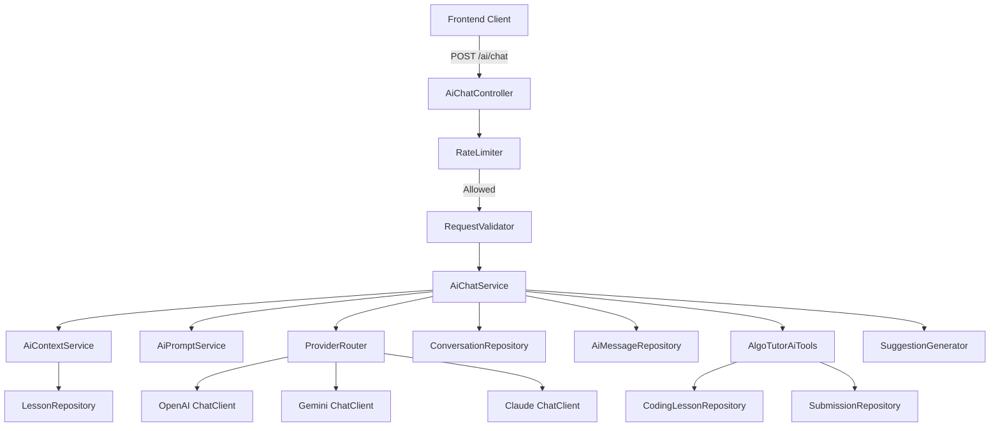
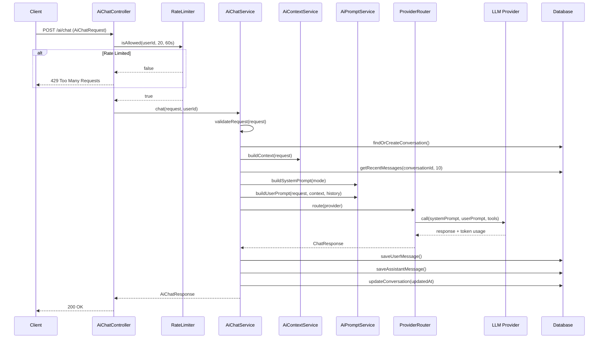

# Design Document: AI Chatbot

## Overview

Tính năng AI Chatbot cho AlgoTutor cung cấp trợ lý học thuật toán thông minh, tích hợp Spring AI framework để giao tiếp với nhiều LLM provider (OpenAI, Gemini, Claude). Hệ thống xây dựng ngữ cảnh từ bài học, lịch sử hội thoại, và kết quả judge để cung cấp phản hồi cá nhân hóa theo từng chế độ chat (HINT, EXPLAIN, DEBUG, REVIEW, COMPLEXITY, SOLUTION, NEXT_STEP).

### Design Decisions

1. **Spring AI ChatClient per provider**: Sử dụng multiple `ChatClient` beans (mỗi provider một bean) thay vì single client, cho phép routing linh hoạt và fallback.
2. **In-memory sliding window rate limiter**: Tận dụng `RateLimiter` component có sẵn trong project thay vì thêm Redis-based rate limiting, phù hợp với single-instance deployment hiện tại.
3. **Tool Functions via Spring AI @Tool annotation**: Sử dụng annotation-based tool registration có sẵn trong Spring AI, cho phép LLM tự quyết định khi nào cần truy vấn thêm thông tin.
4. **Prompt template per mode**: Mỗi `AiChatMode` có system prompt riêng biệt, được inject vào request thay vì dùng single prompt với conditional logic.
5. **Conversation history limit**: Giới hạn 10 messages gần nhất trong context window, với truncation strategy giữ tối thiểu 4 messages (2 cặp user-assistant).

## Architecture



### Request Flow



## Components and Interfaces

### Controller Layer

```java
@RestController
@RequestMapping("/ai")
@RequiredArgsConstructor
public class AiChatController {
    private final AiChatService aiChatService;
    private final RateLimiter rateLimiter;

    @PostMapping("/chat")
    public ResponseEntity<AiChatResponse> chat(
            @Valid @RequestBody AiChatRequest request,
            @AuthenticationPrincipal UserPrincipal principal) {
        // Rate limit check
        // Delegate to service
    }
}
```

### Service Layer

```java
@Service
@RequiredArgsConstructor
public class AiChatService {
    private final AiContextService contextService;
    private final AiPromptService promptService;
    private final ProviderRouter providerRouter;
    private final ConversationRepository conversationRepository;
    private final AiMessageRepository messageRepository;
    private final SuggestionGenerator suggestionGenerator;

    public AiChatResponse chat(AiChatRequest request, UUID userId) {
        // 1. Validate request (mode requires code, content not empty)
        // 2. Find or create conversation
        // 3. Build context from lesson, judge result, error, code
        // 4. Retrieve conversation history (up to 10 messages)
        // 5. Build system prompt (mode-specific) and user prompt
        // 6. Route to LLM provider and call with tools
        // 7. Persist user message and assistant message
        // 8. Generate suggestions
        // 9. Return response
    }
}
```

### Context Builder

```java
@Service
@RequiredArgsConstructor
public class AiContextService {
    private final LessonRepository lessonRepository;

    public String buildContext(AiChatRequest request) {
        // Build labeled context sections:
        // [LESSON_CONTEXT] - from lesson slug (CodingLesson or TheoryLesson)
        // [JUDGE_RESULT] - from judge result string
        // [FAILED_TEST_CASES] - from failed test cases list
        // [ERROR_MESSAGE] - from error message
        // [USER_CODE] - from code + language
    }
}
```

### Prompt Service

```java
@Service
public class AiPromptService {
    private final Map<AiChatMode, String> modePrompts;

    public String buildSystemPrompt(AiChatMode mode) {
        // Base system prompt + mode-specific instructions
    }

    public String buildUserPrompt(AiChatRequest request, String context, String history) {
        // Structured user prompt with context, history, and current request
    }
}
```

### Provider Router

```java
@Component
@RequiredArgsConstructor
public class ProviderRouter {
    private final ChatClient openAiClient;
    private final ChatClient geminiClient;
    private final ChatClient claudeClient;
    private final LLMProvider defaultProvider; // from config

    public ChatClient route(String providerName) {
        // Route to appropriate ChatClient based on provider name
        // Fall back to default if providerName is null
        // Throw AppException if provider is unsupported
    }
}
```

### Suggestion Generator

```java
@Component
public class SuggestionGenerator {
    public List<AiSuggestion> generate(
            AiChatMode currentMode,
            String aiResponse,
            String lessonType) {
        // Generate 2-4 contextual follow-up suggestions
        // Each with label (max 100 chars), mode, and message (max 500 chars)
    }
}
```

### Tool Functions

```java
@Service
@RequiredArgsConstructor
public class AlgoTutorAiTools {
    private final CodingLessonRepository codingLessonRepository;
    private final SubmissionRepository submissionRepository;

    @Tool(description = "Get coding lesson information by lesson ID")
    public ProblemToolResult getCodingLesson(Long codingLessonId) {
        // Return lesson details or structured "not found" response
    }

    @Tool(description = "Get user's latest submission for a lesson")
    public SubmissionToolResult getLatestSubmission(UUID userId, Long codingLessonId) {
        // Return latest submission or structured "no submission" response
    }
}
```

## Data Models

### Entity: AIConversation

| Field | Type | Constraints |
|-------|------|-------------|
| id | UUID | PK, auto-generated |
| userId | UUID | NOT NULL, FK to users |
| lessonId | Long | NULLABLE, FK to lessons |
| title | String | MAX 255 chars |
| provider | LLMProvider (enum) | NOT NULL |
| createdAt | Instant | NOT NULL |
| updatedAt | Instant | NOT NULL |

### Entity: AiMessage

| Field | Type | Constraints |
|-------|------|-------------|
| id | UUID | PK, auto-generated |
| conversationId | UUID | NOT NULL, FK to ai_conversation |
| userId | UUID | NOT NULL |
| role | AiMessageRole (enum) | NOT NULL (SYSTEM, USER, ASSISTANT, TOOL) |
| content | String (TEXT) | NOT NULL |
| mode | String | NULLABLE |
| tokenInput | Integer | NULLABLE |
| tokenOutput | Integer | NULLABLE |
| createdAt | Instant | NOT NULL |

### DTO: AiChatRequest

| Field | Type | Validation |
|-------|------|------------|
| conversationId | UUID | NULLABLE (new conversation if null) |
| lessonId | Long | NULLABLE |
| lessonSlug | String | NULLABLE |
| provider | String | NULLABLE (uses default if null) |
| mode | String | NOT NULL, must match AiChatMode |
| message | String | MAX 5000 chars |
| code | String | MAX 10000 chars |
| language | String | NULLABLE |
| judgeResult | String | NULLABLE |
| errorMessage | String | NULLABLE |
| failedTestCases | List\<String\> | NULLABLE |

**Validation Rule**: At least one of `message` or `code` must be non-null and non-blank.

### DTO: AiChatResponse

| Field | Type | Description |
|-------|------|-------------|
| conversationId | UUID | ID of the conversation |
| answer | String | AI response content |
| mode | String | The chat mode used |
| suggestions | List\<AiSuggestion\> | 2-4 follow-up suggestions |
| sources | List\<AiSource\> | Referenced sources |
| canAskNextHint | Boolean | Whether more hints are available |

### DTO: AiSuggestion

| Field | Type | Constraints |
|-------|------|-------------|
| label | String | MAX 100 chars |
| mode | String | Valid AiChatMode value |
| message | String | MAX 500 chars |

### Enum: AiChatMode

```
HINT, EXPLAIN, DEBUG, REVIEW, COMPLEXITY, SOLUTION, NEXT_STEP
```

### Enum: LLMProvider

```
OPENAI, GEMINI, CLAUDE_SONNET_4_6
```

### Enum: AiMessageRole

```
SYSTEM, USER, ASSISTANT, TOOL
```

## Correctness Properties

*A property is a characteristic or behavior that should hold true across all valid executions of a system — essentially, a formal statement about what the system should do. Properties serve as the bridge between human-readable specifications and machine-verifiable correctness guarantees.*

### Property 1: Mode-specific prompt inclusion

*For any* valid `AiChatMode` value, the system prompt generated by `AiPromptService` SHALL contain mode-specific instructions that correspond to that mode's behavioral constraints (e.g., HINT limits to one hint, SOLUTION allows full answer).

**Validates: Requirements 2.1, 2.2, 2.3, 2.4, 2.5, 2.6, 2.7, 2.9**

### Property 2: Code-required modes reject empty code

*For any* chat request where the mode is one of {DEBUG, REVIEW, COMPLEXITY} and the code field is null, empty, or consists only of whitespace characters, the service SHALL reject the request with a validation error.

**Validates: Requirements 2.8**

### Property 3: Context completeness

*For any* chat request with non-null context fields (judgeResult, errorMessage, failedTestCases, code+language), the context string built by `AiContextService` SHALL contain each non-null field's content within a labeled section.

**Validates: Requirements 3.4, 3.5, 3.6, 3.7**

### Property 4: Coding lesson context includes required fields

*For any* chat request with a lesson slug matching a `CodingLesson`, the built context SHALL contain the lesson's title, difficulty, statement, and constraints.

**Validates: Requirements 3.1**

### Property 5: Theory lesson context includes required fields

*For any* chat request with a lesson slug matching a `TheoryLesson`, the built context SHALL contain the lesson's title, difficulty, and content.

**Validates: Requirements 3.2**

### Property 6: Message persistence round-trip

*For any* successful chat request, exactly two messages SHALL be persisted — one with role USER containing the user's message/code, and one with role ASSISTANT containing the AI response — both with correct conversationId, userId, mode, token counts, and timestamp.

**Validates: Requirements 1.4, 5.2**

### Property 7: Conversation history limit

*For any* conversation with N messages, the history included in the LLM prompt SHALL contain exactly min(N, 10) messages ordered from oldest to newest.

**Validates: Requirements 5.3**

### Property 8: Rate limiter sliding window correctness

*For any* user making a sequence of requests with known timestamps, the rate limiter SHALL allow requests when the count of requests within the 60-second sliding window is ≤ 20, and reject requests when the count exceeds 20.

**Validates: Requirements 7.1, 7.2, 7.3, 7.4**

### Property 9: Input validation — empty content rejection

*For any* chat request where both the message field and the code field are null, empty, or consist only of whitespace characters, the service SHALL reject the request with a validation error.

**Validates: Requirements 9.3**

### Property 10: Input validation — length limits

*For any* chat request where the message field exceeds 5000 characters OR the code field exceeds 10000 characters, the service SHALL reject the request with a validation error indicating the maximum allowed length.

**Validates: Requirements 9.4**

### Property 11: Conversation ownership enforcement

*For any* authenticated user attempting to access a conversation that belongs to a different user, the service SHALL reject the request with an access denied error.

**Validates: Requirements 9.2**

### Property 12: Tool function lesson retrieval

*For any* valid coding lesson ID, the `getCodingLesson` tool function SHALL return a `ProblemToolResult` containing the correct ID, title, difficulty, statement, and constraints matching the persisted lesson entity.

**Validates: Requirements 4.1**

### Property 13: Suggestion structure validity

*For any* successful chat response, the suggestions list SHALL contain between 2 and 4 items, each with a label of at most 100 characters, a mode matching a valid `AiChatMode` value, and a message of at most 500 characters.

**Validates: Requirements 8.1**

### Property 14: canAskNextHint flag correctness

*For any* conversation in HINT mode where the number of ASSISTANT messages with mode HINT is N and the associated coding lesson has M available hints, the `canAskNextHint` flag SHALL be true if N < M and false otherwise.

**Validates: Requirements 8.3**

## Error Handling

| Scenario | HTTP Status | Error Code | Message |
|----------|-------------|------------|---------|
| Unauthenticated request | 401 | NEED_AUTHENTICATION | Authentication required |
| Access denied (wrong conversation owner) | 403 | ACCESS_DENIED | Access denied |
| Invalid mode value | 400 | INVALID_CHAT_MODE | Invalid mode. Accepted: HINT, EXPLAIN, DEBUG, REVIEW, COMPLEXITY, SOLUTION, NEXT_STEP |
| Empty message and code | 400 | INVALID_PAYLOAD | At least one of message or code must be provided |
| Message exceeds 5000 chars | 400 | INVALID_PAYLOAD | Message must not exceed 5000 characters |
| Code exceeds 10000 chars | 400 | INVALID_PAYLOAD | Code must not exceed 10000 characters |
| Code required but missing | 400 | CODE_REQUIRED | Code is required for DEBUG/REVIEW/COMPLEXITY mode |
| Conversation not found | 404 | CONVERSATION_NOT_FOUND | Conversation not found |
| Unsupported provider | 400 | UNSUPPORTED_PROVIDER | Unsupported provider. Accepted: OPENAI, GEMINI, CLAUDE_SONNET_4_6 |
| Rate limit exceeded | 429 | RATE_LIMIT_EXCEEDED | Rate limit reached. Retry after {seconds} seconds |
| LLM timeout (30s) | 503 | AI_SERVICE_UNAVAILABLE | AI service temporarily unavailable. Please retry |
| LLM provider error | 503 | AI_SERVICE_UNAVAILABLE | AI service temporarily unable to process request. Please retry later |
| Unexpected error | 500 | INTERNAL_SERVER_ERROR | An unexpected error occurred. Please try again later |

### Error Handling Strategy

- All errors follow the existing `ErrorResponse` pattern via `AppException` + `ErrorCode`
- LLM provider errors are caught and wrapped — no internal details (API keys, connection strings) are exposed
- Unexpected exceptions are logged with full stack trace but return generic message to client
- Suggestion generation failures are gracefully handled — response returns with empty suggestions list

## Testing Strategy

### Property-Based Testing

**Library**: [jqwik](https://jqwik.net/) — the standard PBT library for Java/JUnit 5

**Configuration**: Minimum 100 iterations per property test.

Property-based tests will cover:
- `AiPromptService`: Mode-specific prompt generation (Property 1)
- `AiContextService`: Context building completeness (Properties 3, 4, 5)
- `RateLimiter`: Sliding window correctness (Property 8)
- Request validation logic: Empty content, length limits, code-required modes (Properties 2, 9, 10)
- Conversation history retrieval: Limit and ordering (Property 7)
- Conversation ownership check (Property 11)
- Tool function retrieval (Property 12)
- Suggestion structure validation (Property 13)
- canAskNextHint flag logic (Property 14)
- Message persistence (Property 6)

Each property test will be tagged with:
```java
@Tag("Feature: ai-chatbot, Property {number}: {property_text}")
```

### Unit Tests (Example-Based)

- Conversation creation when conversationId is null
- Conversation title generation from first message or lesson title
- Default provider routing when provider is null
- Tool function "not found" responses
- Suggestion generation failure graceful handling

### Integration Tests

- LLM provider timeout handling (mocked provider with delay)
- LLM provider error handling (mocked provider returning errors)
- Full chat flow with mocked LLM (controller → service → response)
- Authentication and authorization enforcement via Spring Security test

### Edge Case Tests

- Non-existent conversation ID returns 404
- Non-existent lesson slug — context built without lesson section
- Code field present but language is null — code included without annotation
- Invalid mode string returns validation error with accepted values
- Unsupported provider string returns error with accepted values
