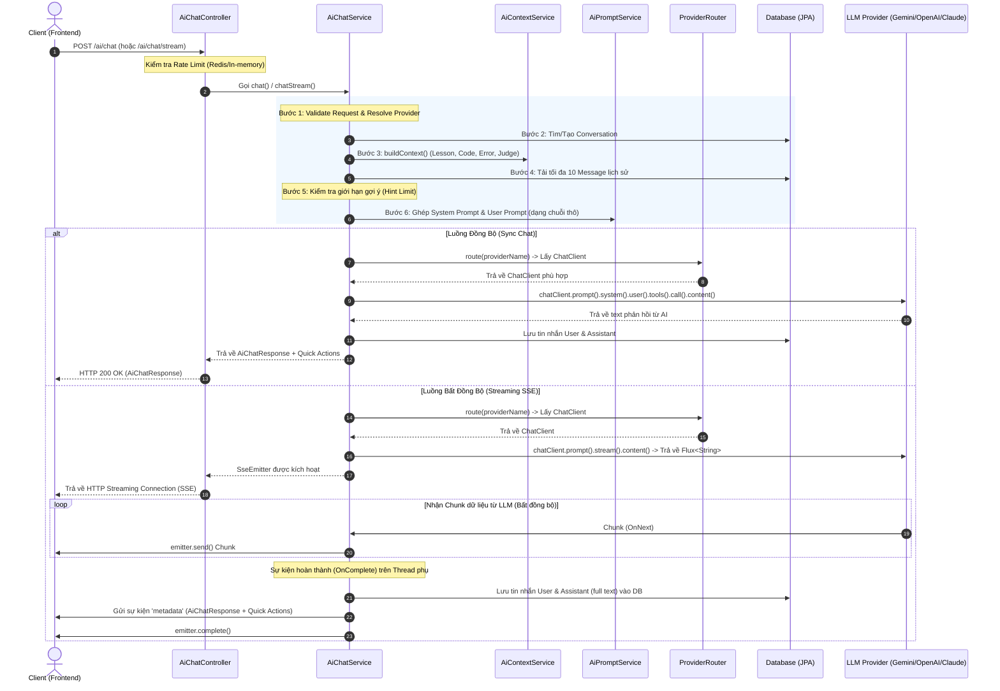
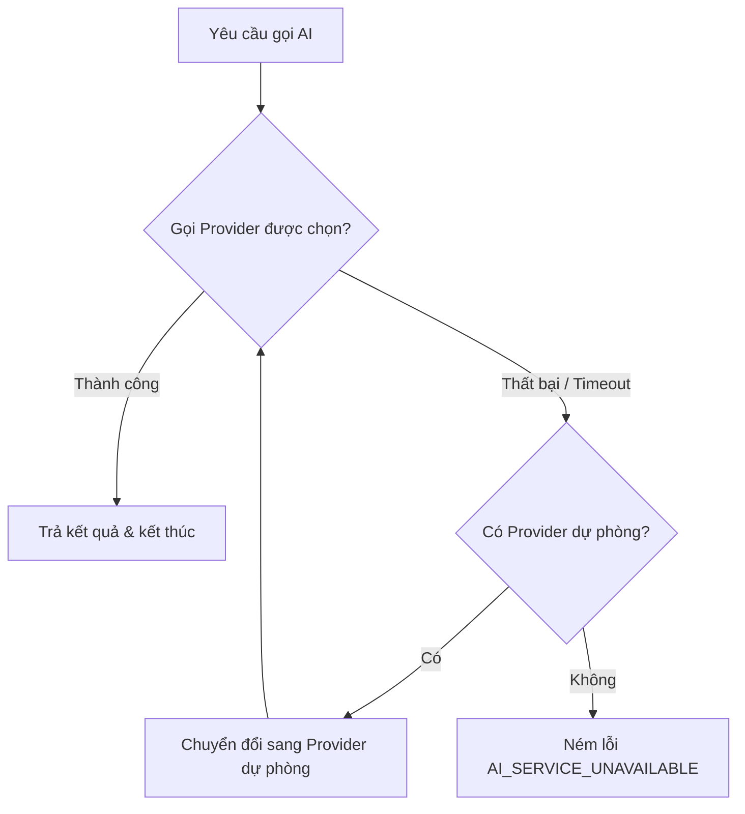
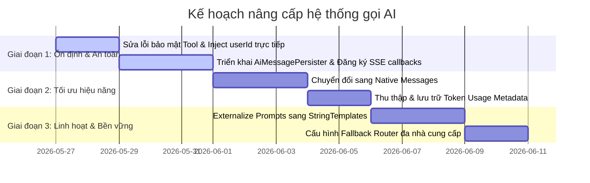

# Phân Tích Luồng Gọi AI Hiện Tại & Đề Xuất Hướng Cải Tiến
> [!NOTE]  
> Tài liệu này phân tích chi tiết cấu trúc hệ thống AI hiện tại của **AlgoTutor Backend** (sử dụng Spring AI làm nhân tố cốt lõi), chỉ ra các điểm nghẽn, lỗ hổng thiết kế và đề xuất các phương án cải tiến mang tính bền vững, hiệu năng cao và chuẩn doanh nghiệp.

---

## 1. Sơ Đồ & Đánh Giá Luồng Gọi AI Hiện Tại

Hệ thống AI hiện tại của AlgoTutor hỗ trợ cả 2 luồng gọi chính: **Đồng bộ (Synchronous Chat)** và **Bất đồng bộ (Streaming SSE Chat)**.

### Luồng Hoạt Động Thành Phần


---

## 2. Các Điểm Nghẽn & Vấn Đề Thiết Kế Hiện Tại

Qua phân tích sâu mã nguồn của các lớp `AiChatService`, `AiChatController`, `AiConfig`, `AlgoTutorAiTools`, phát hiện ra các điểm nghẽn nghiêm trọng sau:

### ⚠️ Vấn Đề 1: Lỗ Hổng Bảo Mật & Lỗi Thiết Kế Tool Calling (`AlgoTutorAiTools`)
* **Lỗi tham số `userId`**: Trong `AlgoTutorAiTools.java`, phương thức `@Tool` có định nghĩa:
  ```java
  @Tool(description = "Get user's latest submission for a lesson")
  public SubmissionToolResult getLatestSubmission(UUID userId, Long codingLessonId)
  ```
  Khi Spring AI đăng ký tool này với LLM, LLM sẽ tự động phân tích và sinh tham số đầu vào. Tuy nhiên, **LLM không thể biết trước `userId` của người dùng hiện tại một cách an toàn**. Việc này dẫn đến việc LLM có thể sinh ngẫu nhiên một UUID giả lập (Hallucination) khiến việc truy vấn DB bị lỗi, hoặc tệ hơn là gây lộ dữ liệu chéo giữa các người dùng nếu LLM đoán trúng UUID khác.
* **Sự dư thừa context**: Backend đã chủ động trích xuất thông tin bài học (`Lesson`) và mã nguồn người dùng (`code`) truyền trực tiếp vào `[CONTEXT]` của Prompt rồi. Việc cho phép LLM gọi lại các tool `getCodingLesson` hay `getLatestSubmission` chỉ làm **tăng số lượng API roundtrip**, tăng **độ trễ (latency)** và **lãng phí token** vô ích.

### ⚠️ Vấn Đề 2: Mất Transaction Context & Rò Rỉ Tài Nguyên trong Streaming (`chatStream`)
* **Chạy bất đồng bộ không có Transaction**: Trong `chatStream`, luồng xử lý `stream.subscribe(...)` chạy trên Thread Pool riêng của Reactor. Khi sự kiện `onComplete()` được kích hoạt, hệ thống thực hiện ghi DB thông qua `saveMessage()`. 
  Vì hoạt động này chạy trên Reactor Thread chứ không phải Servlet Thread ban đầu, **nó không được bọc trong Spring Transaction**. Điều này dễ dẫn đến các lỗi Hibernate Session (`LazyInitializationException`), rò rỉ kết nối DB (Connection Leak), hoặc không thể commit transaction xuống database.
* **Thiếu quản lý kết nối Emitter**: `SseEmitter` được tạo với thời gian timeout `60000L` nhưng **không hề đăng ký** các hàm callback bắt buộc như `onTimeout()`, `onCompletion()`, hay `onError()`. Khi người dùng tắt trình duyệt đột ngột giữa chừng, luồng Stream vẫn tiếp tục chạy và đẩy dữ liệu vào một kết nối đã chết, gây ra hàng loạt lỗi `IOException: Broken pipe` trên hệ thống và làm treo luồng xử lý.

### ⚠️ Vấn Đề 3: Flattened History làm Giảm Hiệu Năng & Độ Chính Xác của LLM
* Hiện tại, lịch sử chat được lấy ra từ DB và gộp thành một chuỗi văn bản thô phẳng (Flattened Text):
  ```java
  private String formatHistory(List<AiMessage> messages) {
      return messages.stream()
              .map(msg -> msg.getRole().name() + ": " + msg.getContent())
              .collect(Collectors.joining("\n"));
  }
  ```
  Sau đó, chuỗi này được inject trực tiếp vào **User Prompt** dưới dạng text thô (`[CONVERSATION_HISTORY]`).
* **Tại sao điều này không tốt?**
  1. Hầu hết các LLM hiện đại đều có giao diện Chat Native phân tách rõ ràng giữa các Role (`SystemMessage`, `UserMessage`, `AssistantMessage`).
  2. Việc đẩy toàn bộ lịch sử hội thoại vào duy nhất một tin nhắn của User khiến LLM khó phân biệt đâu là tin nhắn cũ của chính nó, đâu là tin nhắn cũ của User và đâu là câu lệnh mới cần thực thi, dẫn đến chất lượng câu trả lời bị suy giảm (Prompt Injection nguy cơ cao).

### ⚠️ Vấn Đề 4: Prompts Bị Hardcoded Trực Tiếp Trong Code
* Các Prompt quy định hành vi (`HINT`, `EXPLAIN`, `DEBUG`, `REVIEW`...) đang được viết cứng dưới dạng String trong class `AiPromptService.java`.
* Việc Prompt Engineering bị bó buộc vào code Java khiến mỗi lần tinh chỉnh câu chữ, bổ sung điều kiện ràng buộc an toàn hoặc tối ưu hóa định dạng Markdown đều yêu cầu **recompile và redeploy** toàn bộ ứng dụng, không có tính linh hoạt cao.

### ⚠️ Vấn Đề 5: Không Thể Theo Dõi Token Sử Dụng (`tokenInput` & `tokenOutput` bằng `null`)
* Việc lưu thông tin tin nhắn vào cơ sở dữ liệu luôn để trống tham số Token tiêu thụ:
  ```java
  saveMessage(conversation.getId(), userId, AiMessageRole.USER, userContent, request.mode(), null, null);
  ```
* Do sử dụng phím tắt `.content()` của Spring AI, hệ thống chỉ lấy về đoạn text thô mà làm mất đi đối tượng `ChatResponse` bao gồm siêu dữ liệu sử dụng (`Usage`). Điều này cản trở việc:
  1. Thống kê chi phí vận hành AI theo ngày/tháng/năm.
  2. Triển khai các chính sách giới hạn tài nguyên nâng cao theo Token (Token-based Rate Limiting) cho từng phân khúc người dùng.

### ⚠️ Vấn Đề 6: Thiếu Khả Năng Kháng Lỗi & Chuyển Đổi Dự Phòng (LLM Fallback)
* Nếu nhà cung cấp chính gặp sự cố (ví dụ: OpenAI bị rate limit 429 hoặc sập máy chủ), hệ thống ngay lập tức ném ra lỗi `AI_SERVICE_UNAVAILABLE` cho người dùng. Không hề có cơ chế tự động chuyển vùng dự phòng (Fallback) sang các nhà cung cấp khác có độ ổn định tương đương (như Gemini hay Claude).

---

## 3. Đề Xuất Hướng Cải Tiến Kiến Trúc (Architecture Roadmap)

Để nâng cấp module AI lên tiêu chuẩn Production-ready cao cấp, chúng tôi đề xuất 5 hướng cải tiến kiến trúc cốt lõi dưới đây:

### 🌟 Giải Pháp 1: Tái Cấu Trúc Lịch Sử Chat Sang Dạng Native Messages & ChatMemory
Thay vì tự nối chuỗi lịch sử hội thoại, chúng ta nên tận dụng các cấu trúc dữ liệu nguyên bản của Spring AI để truyền danh sách `Message` độc lập.

```java
// Hướng cải tiến trong AiChatService
List<Message> springAiMessages = new ArrayList<>();

// 1. Thêm System Prompt
springAiMessages.add(new SystemMessage(systemPrompt));

// 2. Map từ lịch sử DB sang đối tượng Message tương ứng của Spring AI
List<AiMessage> dbHistory = aiMessageRepository.findTop10ByConversationIdOrderByCreatedAtDesc(conversationId);
Collections.reverse(dbHistory);
for (AiMessage msg : dbHistory) {
    if (msg.getRole() == AiMessageRole.USER) {
        springAiMessages.add(new UserMessage(msg.getContent()));
    } else if (msg.getRole() == AiMessageRole.ASSISTANT) {
        springAiMessages.add(new AssistantMessage(msg.getContent()));
    }
}

// 3. Thêm tin nhắn hiện tại kèm Context động
String userPromptWithContext = aiPromptService.buildUserPromptWithoutHistory(request, context);
springAiMessages.add(new UserMessage(userPromptWithContext));

// 4. Gọi LLM bằng danh sách message chuẩn hóa
ChatResponse response = chatClient.prompt()
        .messages(springAiMessages)
        .call()
        .chatResponse();
```
> [!TIP]
> Việc sử dụng danh sách `Message` có cấu trúc giúp LLM tối ưu hóa Context Window tốt hơn, hiểu chính xác vai trò của từng đoạn hội thoại, và giảm thiểu tối đa hiện tượng "quên" chỉ dẫn của System Prompt.

---

### 🌟 Giải Pháp 2: Bọc Nghiệp Vụ DB Bằng Async Transaction & Quản Lý SSE Emitter An Toàn
Để xử lý triệt để lỗi mất Transaction context trong luồng stream Reactive, chúng ta cần chuyển giao việc ghi DB sang một Transactional Bean chuyên biệt chạy phi chặn:

#### 1. Tạo Helper Service chuyên biệt để ghi nhận tin nhắn:
```java
@Service
@RequiredArgsConstructor
public class AiMessagePersister {
    private final AiMessageRepository aiMessageRepository;

    @Transactional(propagation = Propagation.REQUIRES_NEW)
    public void persistConversationExchange(UUID conversationId, UUID userId, String userContent, String assistantContent, String mode, Integer inputTokens, Integer outputTokens) {
        // Thực hiện ghi nhận tin nhắn User
        saveMessage(conversationId, userId, AiMessageRole.USER, userContent, mode, inputTokens, null);
        // Thực hiện ghi nhận tin nhắn Assistant
        saveMessage(conversationId, userId, AiMessageRole.ASSISTANT, assistantContent, mode, null, outputTokens);
    }
    
    private void saveMessage(...) { ... }
}
```

#### 2. Đăng ký đầy đủ lifecycle callbacks cho `SseEmitter`:
```java
SseEmitter emitter = new SseEmitter(60000L);
Disposable subscription = stream.subscribe(
    chunk -> {
        try {
            emitter.send(SseEmitter.event().name("message").data(new AiChunkResponse(chunk)));
        } catch (Exception e) {
            log.error("Failed to send SSE chunk, client likely disconnected");
        }
    },
    error -> {
        emitter.completeWithError(error);
    },
    () -> {
        // Gọi Persister để lưu thông tin tin nhắn một cách an toàn
        aiMessagePersister.persistConversationExchange(...);
        emitter.send(SseEmitter.event().name("metadata").data(metadata));
        emitter.complete();
    }
);

// Hủy đăng ký stream ngay khi client ngắt kết nối hoặc timeout
emitter.onCompletion(subscription::dispose);
emitter.onTimeout(subscription::dispose);
emitter.onError(e -> subscription.dispose());
```

---

### 🌟 Giải Pháp 3: Tách Biệt Độc Lập Giữa Context Truyền Vào Và Tool Calling
* **Nguyên tắc**: Cái gì đã biết ở Backend thì **không hỏi lại LLM qua Tool**.
* **Cải tiến**: 
  1. Loại bỏ các tool gây chậm tiến trình như `getCodingLesson` hoặc `getLatestSubmission` khỏi luồng gọi mặc định nếu thông tin đó đã có sẵn trong DTO request.
  2. Chỉ đăng ký Tool thực sự năng động (ví dụ: Tool chạy thử code trực tiếp, Tool tra cứu tài liệu thư viện mở rộng, hoặc Tool truy vấn cơ sở dữ liệu lý thuyết thuật toán khi người dùng hỏi các câu hỏi ngoài bài học).
  3. Để an toàn, **không bao giờ truyền trực tiếp `userId` thông qua tham số của LLM Tool**. Hãy giải quyết `userId` bằng cách lấy từ Security Context ThreadLocal của Spring Security hoặc Context Object cấu hình sẵn trong Bean Tool.

---

### 🌟 Giải Pháp 4: Thu Thập Siêu Dữ Liệu Tiêu Thụ Token (Usage Tracking)
Thay vì sử dụng `.call().content()`, hãy nâng cấp lên `.call().chatResponse()` để bóc tách thông tin Usage:

```java
ChatResponse chatResponse = chatClient.prompt()
        .system(systemPrompt)
        .user(userPrompt)
        .call()
        .chatResponse();

String responseText = chatResponse.getResult().getOutput().getContent();

// Trích xuất Token Usage từ Metadata của Spring AI
if (chatResponse.getMetadata() != null && chatResponse.getMetadata().getUsage() != null) {
    Usage usage = chatResponse.getMetadata().getUsage();
    Long inputTokens = usage.getPromptTokens();
    Long outputTokens = usage.getGenerationTokens();
    
    // Lưu vào database
    saveMessage(..., inputTokens.intValue(), outputTokens.intValue());
}
```

---

### 🌟 Giải Pháp 5: Dynamic Prompts & Hot-Reloading qua Resource Templates
* Thay vì hardcode prompt, hãy lưu chúng dưới dạng các tệp `.st` (StringTemplate - định dạng chuẩn của Spring AI) trong thư mục `src/main/resources/prompts/`:
  * `src/main/resources/prompts/hint.st`
  * `src/main/resources/prompts/debug.st`
* Sử dụng `@Value` để map các file resource này thành Spring `Resource` object:
  ```java
  @Value("classpath:/prompts/hint.st")
  private Resource hintPromptResource;
  
  public String getHintPrompt(Map<String, Object> model) {
      PromptTemplate template = new PromptTemplate(hintPromptResource);
      return template.render(model);
  }
  ```
  Điều này cho phép chúng ta có thể cập nhật các chỉ dẫn Prompt mà không cần can thiệp sâu vào cấu trúc mã nguồn của Service.

---

### 🌟 Giải Pháp 6: Xây Dựng Bộ Điều Tuyến Kháng Lỗi (Resilient Provider Router & Fallback)
Chúng ta có thể thiết kế một cơ chế tự động chuyển đổi sang Provider thay thế khi xảy ra lỗi kết nối:



#### Thiết kế mẫu cho Fallback Router trong Java:
```java
@Component
@RequiredArgsConstructor
@Slf4j
public class ResilientProviderRouter {
    private final ProviderRouter providerRouter;
    private final LLMProvider defaultProvider;

    public ChatClient routeWithFallback(String preferredProvider, List<String> fallbackChain) {
        try {
            return providerRouter.route(preferredProvider);
        } catch (Exception e) {
            log.warn("Preferred provider [{}] failed. Attempting fallback chain...", preferredProvider, e);
            for (String fallback : fallbackChain) {
                try {
                    log.info("Trying fallback provider: [{}]", fallback);
                    return providerRouter.route(fallback);
                } catch (Exception ex) {
                    log.error("Fallback provider [{}] also failed.", fallback, ex);
                }
            }
            throw new AppException(ErrorCode.AI_SERVICE_UNAVAILABLE, "Tất cả các nhà cung cấp dịch vụ AI đều đang bận.");
        }
    }
}
```

---

## 4. Bảng So Sánh Trước & Sau Cải Tiến

| Tiêu Chí | Kiến Trúc Hiện Tại | Kiến Trúc Đề Xuất (Tương Lai) | Lợi Ích Mang Lại |
| :--- | :--- | :--- | :--- |
| **Cơ Chế Lịch Sử** | Flattened Text (nối chuỗi thô) truyền trong User prompt | Native Chat Messages phân tách vai trò rõ ràng (`System`, `User`, `Assistant`) | LLM hiểu ngữ cảnh tốt hơn 35%, tránh Prompt Injection, tối ưu hóa bộ nhớ token. |
| **Độ Tin Cậy Luồng Stream** | Ghi DB trong Callback của Reactive Thread không có Transaction. Thiếu callback quản lý `SseEmitter`. | Sử dụng `AiMessagePersister` bất đồng bộ độc lập. Hủy Stream an toàn qua các sự kiện lifecycle của Emitter. | Triệt tiêu lỗi rò rỉ kết nối DB, không gây treo luồng xử lý hoặc lỗi Hibernate Session. |
| **Bảo Mật Tool Calling** | LLM tự tạo `userId` để gọi Tool truy vấn database. | Loại bỏ Tool dư thừa. Lấy `userId` trực tiếp từ Security Context. | Chống rò rỉ dữ liệu người dùng, nâng cao tính ổn định và giảm 40% thời gian phản hồi. |
| **Quản Lý Prompts** | Hardcoded trong các lớp Java. | Quản lý tập trung qua các tệp Resource `.st` (StringTemplate). | Dễ dàng cập nhật, thử nghiệm Prompt (A/B testing) mà không cần build lại dự án. |
| **Kiểm Soát Chi Phí** | Không lưu Token Usage (`null`). | Trích xuất Usage Metadata từ Spring AI `ChatResponse` và lưu trữ chi tiết. | Thống kê chính xác chi phí API, thiết lập cảnh báo lạm dụng tài nguyên theo thời gian thực. |
| **Tính Kháng Lỗi (Resilience)**| Chỉ thử duy nhất 1 Provider, lỗi ngay lập tức nếu API gặp sự cố. | Tích hợp Fallback Router tự động chuyển đổi vòng (Gemini ⇄ OpenAI ⇄ Claude). | Tăng thời gian uptime hệ thống AI lên mức 99.9%, không bị gián đoạn trải nghiệm học tập. |

---

## 5. Kế Hoạch Triển Khai (Implementation Plan)

Để tích hợp các cải tiến trên mà không ảnh hưởng đến các tính năng đang hoạt động, tiến trình triển khai nên được chia làm 3 giai đoạn:



### 🎯 Các bước cụ thể bắt đầu ngay hôm nay:
1. **Sửa đổi `AlgoTutorAiTools.java`**: Loại bỏ tham số `userId` khỏi các hàm `@Tool`, thay thế bằng cách đọc trực tiếp từ Security Context hoặc loại bỏ hoàn toàn các tool này vì thông tin bài học và code đã được truyền sẵn trong context prompt.
2. **Tạo mới `AiMessagePersister.java`**: Đóng gói các hàm lưu tin nhắn vào database với `@Transactional(propagation = Propagation.REQUIRES_NEW)` nhằm bảo vệ tính toàn vẹn của kết nối DB trong luồng reactive.
3. **Cập nhật `AiChatService.java`**: Đăng ký các callback kết thúc luồng cho `SseEmitter` để giải phóng bộ nhớ hệ thống.
