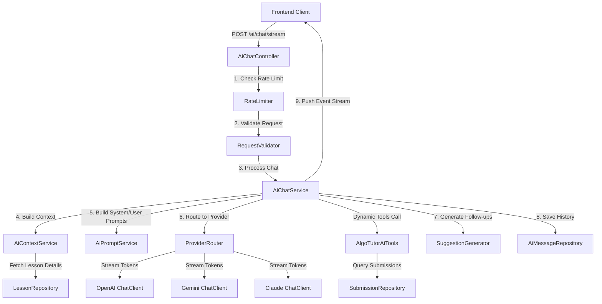

# ĐỀ XUẤT PHÁT TRIỂN HỆ THỐNG AI CHATBOT (ALGOTUTOR)
## Đồng bộ hóa Kiến trúc & Kế hoạch triển khai Backend (BE)

Tài liệu này trình bày định hướng tích hợp tính năng Trợ lý ảo AI (AI Chatbot) cho nền tảng AlgoTutor. Kế hoạch này được thiết kế để giải quyết toàn diện các yêu cầu từ phía Frontend (FE) về trải nghiệm người dùng tối ưu, đồng thời tối ưu hóa chi phí vận hành và tài nguyên hệ thống ở phía Backend (BE).

---

## 1. TỔNG QUAN ĐỊNH HƯỚNG TỪ FRONTEND (FE)

Theo định hướng thiết kế và tài liệu API học tập (`docs/LEARNING_API_FE.md`), giao diện học tập của AlgoTutor sẽ được tích hợp một khung chat với Trợ lý AI có các đặc tính sau:
- **Ngữ cảnh cô lập theo từng bài học (Context-Aware)**: Trợ lý AI phải biết người dùng đang ở bài học nào (Lý thuyết, Trắc nghiệm hay Lập trình), mã nguồn hiện tại của họ là gì, và kết quả chấm bài gần nhất ra sao để phản hồi chính xác, không đưa ra các kiến thức vượt ngoài phạm vi bài học.
- **Trải nghiệm gõ chữ theo thời gian thực (SSE Streaming)**: Để tránh tình trạng người dùng phải chờ đợi lâu khi LLM sinh câu trả lời dài (thường mất từ 5-15 giây), BE **nên hỗ trợ streaming response (SSE - Server-Sent Events)** giúp FE hiển thị câu trả lời dạng chữ chạy mượt mà, nâng cao đáng kể cảm nhận về hiệu năng hệ thống.
- **Gợi ý hành động nhanh (Quick Actions / Suggestions)**: Sau mỗi phản hồi của AI, hệ thống cần tự động gợi ý từ 2 đến 4 câu hỏi tiếp theo (ví dụ: *"Giải thích độ phức tạp thuật toán này"*, *"Tìm edge cases của code"*...) để định hướng học viên tiếp cận lời giải một cách khoa học.
- **Phục hồi gợi ý từng bước (Hints Flow)**: Tránh việc AI đưa ra lời giải ngay lập tức. AI sẽ đưa ra các gợi ý nhỏ (Hint) tăng dần theo yêu cầu của học viên và tự động khóa nút yêu cầu Hint mới nếu học viên đã xem hết số lượng gợi ý được cấu hình cho bài học lập trình đó.

---

## 2. KIẾN TRÚC HỆ THỐNG BE ĐỀ XUẤT

Để đáp ứng trọn vẹn các định hướng trên, Backend AlgoTutor sử dụng thư viện **Spring AI** làm nền tảng cốt lõi, phối hợp với cơ sở dữ liệu quan hệ PostgreSQL và bộ giới hạn tần suất (Rate Limiter) nội bộ.

### Sơ đồ luồng xử lý (Request Flow)



---

## 3. THIẾT KẾ CHI TIẾT CÁC THÀNH PHẦN BE

### 3.1. Các API Endpoints phục vụ FE

#### 1. API Khởi tạo Hội thoại (Bootstrap)
- **Endpoint**: `GET /api/v1/ai/chat/bootstrap?lessonSlug={lessonSlug}`
- **Mục đích**: Lấy tin nhắn chào mừng (Onboarding message) được cá nhân hóa theo bài học và lấy `conversationId` của cuộc trò chuyện gần nhất trong bài học đó (nếu có) để tiếp tục cuộc đối thoại.
- **Đầu ra**: 
  ```json
  {
    "success": true,
    "data": {
      "conversationId": "3fa85f64-5717-4562-b3fc-2c963f66afa6",
      "answer": "Chào mừng bạn đến với bài học 'Two Sum'. Tôi có thể giúp bạn hiểu đề bài, gợi ý hướng giải quyết hoặc tìm lỗi trong code của bạn. Bạn muốn bắt đầu từ đâu?",
      "mode": "BOOTSTRAP",
      "quickActions": [
        { "label": "Giải thích đề bài", "intent": "EXPLAIN_PROBLEM", "mode": "EXPLAIN", "message": "Giải thích chi tiết cho tôi đề bài Two Sum này nhé." },
        { "label": "Cho tôi gợi ý hướng giải", "intent": "GIVE_HINT", "mode": "HINT", "message": "Cho tôi xin gợi ý đầu tiên để giải quyết bài toán này." }
      ],
      "canAskNextHint": true
    }
  }
  ```

#### 2. API Gửi tin nhắn đơn luồng (Blocking Chat - Dùng làm dự phòng)
- **Endpoint**: `POST /api/v1/ai/chat`
- **Mục đích**: Gửi yêu cầu chat thông thường, trả về toàn bộ câu trả lời cùng một lúc.
- **Đầu vào (AiChatRequest)**:
  ```json
  {
    "conversationId": "3fa85f64-5717-4562-b3fc-2c963f66afa6",
    "lessonId": 3,
    "lessonSlug": "two-sum-coding",
    "provider": "GEMINI",
    "mode": "HINT",
    "message": "Tôi đang bị tắc ở bước tối ưu...",
    "code": "class Solution { ... }",
    "language": "java",
    "judgeResult": "WRONG_ANSWER",
    "errorMessage": null,
    "failedTestCases": ["Input: [3,3] Target: 6 | Expected: [0,1], Got: [0,0]"]
  }
  ```

#### 3. API Streaming thời gian thực (SSE Streaming Chat - FE Chính thức sử dụng)
- **Endpoint**: `POST /api/v1/ai/chat/stream`
- **Cơ chế**: Trả về luồng dữ liệu `text/event-stream`.
- **Luồng dữ liệu đẩy về FE**:
  - **Events dạng tin nhắn (Chunks)**: Trả về từng mảnh chữ nhỏ của câu trả lời từ AI (`data: {"answer": "Để"}`).
  - **Event kết thúc (Done/Metadata)**: Gói dữ liệu cuối cùng gửi về sẽ chứa toàn bộ metadata bao gồm `conversationId`, danh sách câu hỏi gợi ý nhanh (`quickActions`), và cờ trạng thái gợi ý (`canAskNextHint`).
  ```
  event: message
  data: {"answer": "Để "}
  
  event: message
  data: {"answer": "tối ưu bài "}
  
  event: message
  data: {"answer": "này, bạn... "}
  
  event: metadata
  data: {"conversationId": "...", "mode": "HINT", "quickActions": [...], "canAskNextHint": false}
  ```

---

### 3.2. Cấu trúc Dữ liệu Cơ sở (Database Schema)

Để lưu giữ trọn vẹn lịch sử hội thoại và phục vụ ngữ cảnh cho mô hình AI, BE thiết lập 2 bảng chính:

#### 1. Bảng `ai_conversation` (Lưu trữ phiên hội thoại)
- `id` (UUID PK): Khóa chính tự sinh.
- `user_id` (UUID - FK): Định danh người dùng sở hữu cuộc trò chuyện (được bảo mật chặt chẽ ở tầng API, tránh học viên xem trộm lịch sử của nhau).
- `lesson_id` (Long - Nullable FK): Liên kết với bài học hiện tại.
- `title` (VARCHAR 255): Tiêu đề hội thoại (tự động cắt từ tin nhắn đầu tiên của người dùng hoặc lấy tên bài học).
- `provider` (VARCHAR 50): Nhà cung cấp LLM được chọn (`OPENAI`, `GEMINI`, `CLAUDE`).
- `created_at` / `updated_at` (TIMESTAMP): Theo dõi thời gian tạo và cập nhật tin nhắn mới nhất.

#### 2. Bảng `ai_messages` (Lưu trữ chi tiết tin nhắn trong cuộc hội thoại)
- `id` (UUID PK): Khóa chính tự sinh.
- `conversation_id` (UUID - FK): Liên kết với phiên chat.
- `user_id` (UUID): Người dùng gửi hoặc nhận tin nhắn.
- `role` (VARCHAR 50): Vai trò tin nhắn (`USER`, `ASSISTANT`, `SYSTEM`, `TOOL`).
- `content` (TEXT): Nội dung chi tiết của tin nhắn hoặc mã nguồn đính kèm.
- `mode` (VARCHAR 50): Chế độ tương tác lúc gửi tin nhắn (`HINT`, `DEBUG`, v.v.).
- `token_input` / `token_output` (INTEGER): Thống kê số lượng token tiêu thụ phục vụ việc phân tích chi phí.
- `created_at` (TIMESTAMP): Thời gian gửi tin nhắn.

---

### 3.3. Các Chế độ Trợ giúp (AI Chat Modes) & Prompt Engineering

Hệ thống cung cấp Prompt hệ thống (System Prompt) riêng biệt và khắt khe cho từng chế độ tương tác:

| Chế độ Chat (Mode) | Hành vi và Prompt ràng buộc của LLM | Ràng buộc dữ liệu |
| :--- | :--- | :--- |
| **`HINT`** | Chỉ đưa ra **một gợi ý duy nhất không quá 2 câu**. Tuyệt đối không viết code giải hay đưa ra lời giải đầy đủ. Khuyến khích học viên tự suy nghĩ. | Không bắt buộc code |
| **`EXPLAIN`** | Giải thích lý thuyết thuật toán liên quan đến bài học, bao gồm định nghĩa, cách hoạt động và ví dụ minh họa trực quan. | Không bắt buộc code |
| **`DEBUG`** | Chỉ ra nguyên nhân gốc rễ gây ra lỗi (ví dụ: tràn số, trỏ Null, vòng lặp vô hạn). **Chỉ hướng dẫn sửa đổi chứ không viết lại đoạn code đã sửa cho học viên.** | **Bắt buộc gửi kèm Code** |
| **`REVIEW`** | Đánh giá chất lượng code của học viên dựa trên: tính đúng đắn logic, phong cách viết code (style), và khả năng tối ưu hóa. Tổ chức nhận xét thành các danh mục rõ ràng. | **Bắt buộc gửi kèm Code** |
| **`COMPLEXITY`** | Phân tích chi tiết độ phức tạp thời gian (Time Complexity) và không gian (Space Complexity) của code sử dụng ký pháp Big-O, giải thích cặn kẽ tại sao lại có độ phức tạp đó. | **Bắt buộc gửi kèm Code** |
| **`SOLUTION`** | Đưa ra lời giải hoàn chỉnh tối ưu, giải thích từng bước tiếp cận và code mẫu đầy đủ kèm ghi chú giải thích dòng lệnh. | Không bắt buộc code |
| **`NEXT_STEP`** | Đưa ra **chỉ một bước đi tiếp theo cụ thể và có thể thực hành ngay** để học viên tiến dần đến lời giải (ví dụ: *"Bước tiếp theo, bạn hãy khai báo một mảng phụ để lưu..."*). | Không bắt buộc code |

---

### 3.4. Cơ chế Đề xuất câu hỏi nhanh (Quick Actions Generator)

Sau mỗi câu trả lời của AI, hệ thống `SuggestionGenerator` của BE sẽ tự động tạo từ 2-4 đề xuất câu hỏi thông minh giúp học viên dễ dàng click hỏi tiếp:
- **Tình huống bài Coding bị lỗi compile/runtime**: Đề xuất nhanh nút **"Giải thích thông báo lỗi này"** (chuyển sang mode `DEBUG`) hoặc **"Cho tôi một gợi ý sửa lỗi"** (mode `HINT`).
- **Tình huống code đã chạy thành công nhưng chưa tối ưu**: Đề xuất nhanh nút **"Phân tích độ phức tạp Big-O"** (mode `COMPLEXITY`) hoặc **"Đánh giá và tối ưu hóa code"** (mode `REVIEW`).
- **Học viên đang xem lý thuyết (Theory Lesson)**: Đề xuất nút **"Cho tôi ví dụ thực tế"** (mode `EXPLAIN`) hoặc **"Tôi cần làm gì tiếp theo?"** (mode `NEXT_STEP`).

---

### 3.5. Kiểm soát tần suất và Bảo mật (Rate Limiting & Security)

Để tránh nguy cơ hệ thống bị spam gây bùng nổ chi phí API LLM, BE cài đặt hai chốt chặn bảo vệ:
1. **Xác thực người dùng**: Tất cả các cuộc gọi API chat bắt buộc đi kèm Token xác thực hợp lệ. Bộ lọc bảo mật sẽ kiểm tra quyền sở hữu `userId` đối với `conversationId` trong yêu cầu. Nếu không khớp sẽ lập tức trả về lỗi `403 Access Denied`.
2. **Rate Limiting theo cơ chế Cửa sổ trượt (Sliding Window)**: Giới hạn mỗi học viên chỉ được gửi tối đa **20 câu hỏi AI trong vòng 60 giây**. Nếu vượt quá giới hạn, BE sẽ phản hồi lỗi `429 Too Many Requests` và chỉ rõ số giây học viên cần chờ đợi để có thể thực hiện câu hỏi tiếp theo.

---

## 4. KẾ HOẠCH TRIỂN KHAI VÀ KHỐI LƯỢNG CÔNG VIỆC CHÍNH

Kế hoạch hoàn thiện Backend AI Chatbot sẽ diễn ra theo 4 bước lớn:

### Bước 1: Phát triển API Streaming và Tích hợp SSE (`AiChatController` & `AiChatService`)
- Hiện thực hóa method `chatStream` trong `AiChatService` sử dụng đối tượng `ChatClient` dạng stream của Spring AI.
- Xây dựng endpoint `POST /api/v1/ai/chat/stream` trả về `SseEmitter` để đẩy từng token văn bản về FE theo cơ chế Server-Sent Events.
- Đảm bảo lưu lịch sử tin nhắn (`USER` và `ASSISTANT`) vào database PostgreSQL một cách bất đồng bộ ngay sau khi LLM kết thúc stream thành công.

### Bước 2: Hiện thực hóa Bộ tạo gợi ý thông minh (`SuggestionGenerator`)
- Viết mới component `SuggestionGenerator` để chuyển đổi và sinh ra danh sách `AiQuickAction` phù hợp cho từng loại bài học và chế độ chat của học viên.
- Lập trình logic kiểm soát cờ `canAskNextHint`: Truy vấn số lượng tin nhắn `HINT` của người dùng trong phiên chat này và so sánh với tổng số hint tối đa được phép hiển thị trong bài học lập trình.

### Bước 3: Khôi phục và mở rộng Bộ kiểm thử tự động (Unit, Integration & Property-based Tests)
- Tái lập các file kiểm thử tự động đã bị xóa trong thư mục `src/test/java/org/rap/algotutorbe/ai/services/`:
  - Viết Unit Tests độc lập cho `AiPromptService`, `AiContextService` và `ProviderRouter` sử dụng JUnit 5 và Mockito.
  - Viết Integration Tests giả lập luồng gọi API và kiểm tra Rate Limiter.
  - Tích hợp kiểm thử dựa trên thuộc tính (Property-Based Testing) với thư viện **jqwik** để kiểm chứng độ tin cậy của tầng lọc dữ liệu đầu vào.

### Bước 4: Kiểm thử tích hợp hệ thống (E2E Integration)
- Thực hiện chạy thử toàn diện dự án trên môi trường Local, kết nối thực tế với API OpenAI và Gemini.
- Sử dụng các công cụ Client (như Postman) kiểm tra định dạng gói dữ liệu Event Stream trả về từ endpoint `/ai/chat/stream`.

---

## 5. KẾT LUẬN

Bản kế hoạch triển khai Backend AI Chatbot này cam kết mang lại một trợ lý học tập cực kỳ thông minh, cá nhân hóa sâu sắc theo tiến độ học của từng học viên, đồng thời cung cấp trải nghiệm streaming SSE mượt mượt mà, phản hồi ngay tức thì theo chuẩn thiết kế cao cấp nhất của Frontend AlgoTutor. 

Kế hoạch đã sẵn sàng để chuyển sang giai đoạn lập trình và tích hợp ngay sau khi nhận được sự phê duyệt từ phía bạn!
