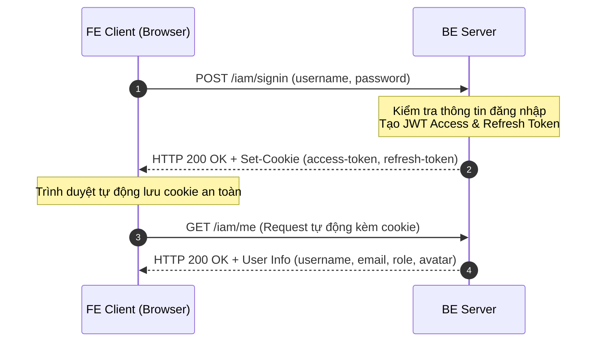
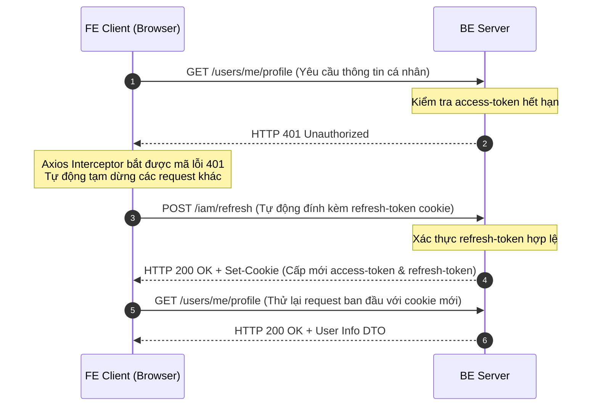
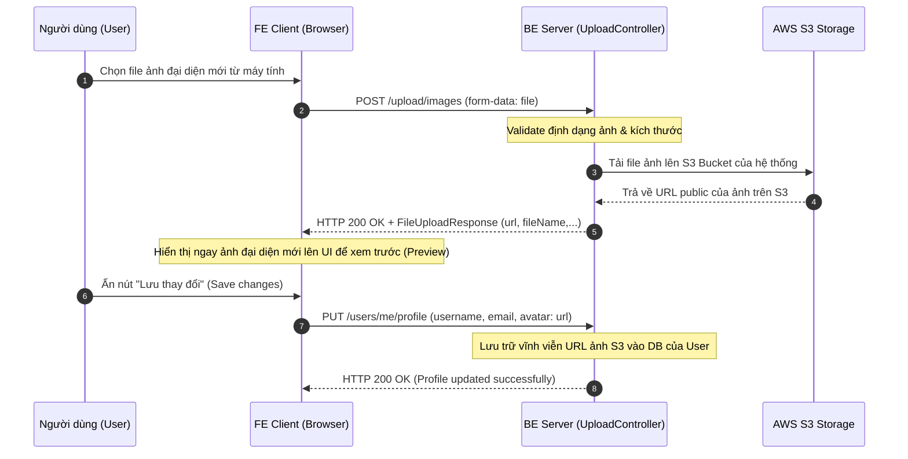

# Hướng Dẫn Tích Hợp API - Phân Hệ IAM (Identity & Access Management)
> Tài liệu hướng dẫn tích hợp hệ thống xác thực, phân quyền và quản lý tài khoản người dùng dành cho Front-End (FE) Client kết nối với Back-End (BE).
>
> **Lưu ý:** Tài liệu này chỉ tập trung vào các chức năng dành cho **User/Client** thông thường và bỏ qua toàn bộ các API quản trị của Admin.

---

## 1. Tổng Quan Kiến Trúc Xác Thực (Security Architecture)

Hệ thống xác thực của **AlgoTutor** sử dụng mô hình bảo mật JWT nâng cao kết hợp **HttpOnly Cookies** để bảo vệ phiên làm việc của người dùng một cách tối đa, giảm thiểu rủi ro bị tấn công đánh cắp token qua XSS (Cross-Site Scripting).

### Cơ chế lưu trữ Token phía Client:
* **Không lưu trữ token trong LocalStorage / SessionStorage:** FE tuyệt đối không lưu access token hay refresh token dưới dạng localStorage vì các vị trí này dễ bị khai thác bởi mã độc JS.
* **HttpOnly Cookies:** Khi đăng nhập thành công hoặc refresh token, BE sẽ tự động thiết lập 2 cookies vào trình duyệt của client:
  1. `access-token`: JWT ngắn hạn dùng để xác thực từng request.
  2. `refresh-token`: JWT dài hạn dùng để xin cấp mới `access-token`.
* **Cấu hình Cookie:** 
  * `HttpOnly = true` (Trình duyệt chặn Javascript đọc cookie này).
  * `SameSite = Strict` (Ngăn chặn tấn công CSRF).
  * `Secure = true` (Chỉ truyền qua giao thức HTTPS bảo mật).
  * `Path = /` (Có hiệu lực trên toàn trang).

> [!IMPORTANT]
> **Yêu cầu bắt buộc phía Front-End:**
> Mọi request HTTP gửi từ FE lên BE (Fetch API, Axios,...) bắt buộc phải bật cấu hình **credentials** (`withCredentials: true` đối với Axios hoặc `credentials: 'include'` đối với Fetch API). Nếu thiếu cấu hình này, trình duyệt sẽ không gửi kèm cookies và BE sẽ phản hồi lỗi `401 Unauthorized`.

---

## 2. Luồng Hoạt Động Xác Thực (Authentication Flow Diagrams)

### Luồng Đăng Nhập & Thiết Lập Session


### Luồng Tự Động Làm Mới Phiên Đăng Nhập (Auto Refresh Token)


### Luồng Tải Lên Ảnh Đại Diện & Cập Nhật Hồ Sơ (Avatar Upload & Save Flow)


---

## 3. Danh Sách API Phân Hệ IAM & Quản Lý Hồ Sơ

Tất cả các API trả về cấu trúc bọc chuẩn `ApiResponse` có dạng:
```json
{
  "success": true,
  "message": "Thông báo nếu có",
  "data": { ... } // Dữ liệu phản hồi thực tế (nếu có)
}
```

### 3.1 Nhóm API Xác Thực Hệ Thống (`/iam`)

#### 1. Đăng ký tài khoản (Sign Up)
* **Endpoint:** `/iam/signup`
* **Method:** `POST`
* **Xác thực:** Không yêu cầu (`Public`)
* **Request Body (`SignUpRequest`):**
  ```json
  {
    "username": "codestar2026",
    "email": "codestar@algotutor.vn",
    "password": "StrongPassword@123",
    "confirmPassword": "StrongPassword@123"
  }
  ```
* **Phản hồi mẫu (HTTP 201 Created):**
  ```json
  {
    "success": true,
    "message": "Sign up success"
  }
  ```

#### 2. Đăng nhập hệ thống (Sign In)
* **Endpoint:** `/iam/signin`
* **Method:** `POST`
* **Xác thực:** Không yêu cầu (`Public`)
* **Request Body (`SignInRequest`):**
  ```json
  {
    "username": "codestar2026",
    "password": "StrongPassword@123"
  }
  ```
* **Phản hồi mẫu (HTTP 200 OK):**
  * *Header:* Trình duyệt tự động nhận 2 cookies `access-token` và `refresh-token`.
  * *Body:*
    ```json
    {
      "success": true,
      "data": "Login success"
    }
    ```

#### 3. Làm mới phiên đăng nhập (Refresh Token)
* **Endpoint:** `/iam/refresh`
* **Method:** `POST`
* **Xác thực:** Yêu cầu Cookie `refresh-token` gửi kèm.
* **Request Body:** Không có.
* **Phản hồi mẫu (HTTP 200 OK):**
  * *Header:* Cập nhật mới 2 cookies `access-token` và `refresh-token`.
  * *Body:*
    ```json
    {
      "success": true,
      "message": "Refresh success"
    }
    ```

#### 4. Đăng xuất hệ thống (Logout)
* **Endpoint:** `/iam/logout`
* **Method:** `POST`
* **Xác thực:** Yêu cầu Cookie `refresh-token` gửi kèm.
* **Request Body:** Không có.
* **Phản hồi mẫu (HTTP 200 OK):**
  * *Header:* Trình duyệt tự động xóa 2 cookies (Max-Age set về 0).
  * *Body:*
    ```json
    {
      "success": true,
      "message": "Logout success"
    }
    ```

#### 5. Lấy nhanh thông tin tài khoản hiện tại
* **Endpoint:** `/iam/me`
* **Method:** `GET`
* **Xác thực:** Yêu cầu Cookie `access-token`.
* **Phản hồi mẫu (HTTP 200 OK):**
  ```json
  {
    "success": true,
    "data": {
      "id": "c0a80164-8fc9-19a3-818f-c9fffa530000",
      "username": "codestar2026",
      "email": "codestar@algotutor.vn",
      "role": "USER",
      "avatar": "https://api.dicebear.com/7.x/adventurer/svg?seed=codestar",
      "enabled": true,
      "blockReason": null
    }
  }
  ```

---

### 3.2 Nhóm API Quản Lý Hồ Sơ & Phiên Hoạt Động (`/users`)

#### 1. Lấy thông tin chi tiết hồ sơ người dùng (User Profile)
* **Endpoint:** `/users/me`
* **Method:** `GET`
* **Phản hồi mẫu (HTTP 200 OK):**
  ```json
  {
    "success": true,
    "data": {
      "id": "c0a80164-8fc9-19a3-818f-c9fffa530000",
      "username": "codestar2026",
      "email": "codestar@algotutor.vn",
      "avatarUrl": "https://api.dicebear.com/7.x/adventurer/svg?seed=codestar"
    }
  }
  ```

#### 2. Lấy thông tin tài khoản (User Info)
* **Endpoint:** `/users/me/profile`
* **Method:** `GET`
* **Phản hồi mẫu (HTTP 200 OK):**
  ```json
  {
    "success": true,
    "data": {
      "id": "c0a80164-8fc9-19a3-818f-c9fffa530000",
      "username": "codestar2026",
      "email": "codestar@algotutor.vn",
      "role": "USER",
      "avatar": "https://api.dicebear.com/7.x/adventurer/svg?seed=codestar",
      "enabled": true,
      "blockReason": null
    }
  }
  ```

#### 3. Cập nhật hồ sơ cá nhân
* **Endpoint:** `/users/me/profile`
* **Method:** `PUT`
* **Request Body (`UpdateProfileRequest`):**
  ```json
  {
    "username": "codestar.newname",
    "email": "codestar.newemail@algotutor.vn",
    "avatar": "https://link-to-avatar.png"
  }
  ```
> [!TIP]
> **Quy trình cập nhật ảnh đại diện (avatar):** 
> 1. FE không gửi trực tiếp file binary của ảnh lên API này. 
> 2. Trước hết, FE cần gọi API `/upload/images` (xem chi tiết ở phần 3.4) để tải ảnh lên S3.
> 3. Lấy trường `url` trả về từ API upload để điền vào trường `avatar` ở body trên, sau đó mới gửi request `PUT` này để lưu thay đổi.

* **Phản hồi mẫu (HTTP 200 OK):**
  ```json
  {
    "success": true,
    "message": "Profile updated successfully"
  }
  ```

#### 4. Thay đổi mật khẩu tài khoản
* **Endpoint:** `/users/me/change-password`
* **Method:** `PUT`
* **Request Body (`ChangePasswordRequest`):**
  ```json
  {
    "oldPassword": "CurrentPassword@123",
    "newPassword": "NewStrongPassword@999",
    "confirmPassword": "NewStrongPassword@999"
  }
  ```
* **Phản hồi mẫu (HTTP 200 OK):**
  ```json
  {
    "success": true,
    "message": "Password changed successfully"
  }
  ```

#### 5. Danh sách các thiết bị/phiên đang đăng nhập
* **Endpoint:** `/users/me/sessions`
* **Method:** `GET`
* **Phản hồi mẫu (HTTP 200 OK):**
  ```json
  {
    "success": true,
    "data": [
      {
        "id": 12,
        "ipAddress": "192.168.1.15",
        "deviceInfo": "Mozilla/5.0 (Windows NT 10.0; Win64; x64) Chrome/124.0.0.0",
        "createdAt": "2026-05-29T07:15:30Z",
        "expiresAt": "2026-06-29T07:15:30Z",
        "isCurrent": true
      },
      {
        "id": 8,
        "ipAddress": "115.79.138.22",
        "deviceInfo": "Mozilla/5.0 (iPhone; CPU iPhone OS 17_4 like Mac OS X) Safari/604.1",
        "createdAt": "2026-05-28T14:20:11Z",
        "expiresAt": "2026-06-28T14:20:11Z",
        "isCurrent": false
      }
    ]
  }
  ```

#### 6. Hủy một phiên đăng nhập cụ thể (Đăng xuất từ xa)
* **Endpoint:** `/users/me/sessions/{id}`
* **Method:** `DELETE`
* **Path Parameter:** `id` (Mã phiên đăng nhập)
* **Phản hồi mẫu (HTTP 200 OK):**
  ```json
  {
    "success": true,
    "message": "Session terminated successfully"
  }
  ```

#### 7. Hủy tất cả các phiên đăng nhập khác (Giữ lại phiên hiện tại)
* **Endpoint:** `/users/me/sessions/other`
* **Method:** `DELETE`
* **Phản hồi mẫu (HTTP 200 OK):**
  ```json
  {
    "success": true,
    "message": "Other sessions terminated successfully"
  }
  ```

---

### 3.3 Nhóm API Thông Tin Học Tập của User Hiện Tại (`/users/me/*`)

Các API bổ trợ giúp hiển thị trạng thái và tiến độ học tập trực quan trên giao diện Dashboard/Trang cá nhân của User.

#### 1. Lấy thông tin bài học đang học dở
* **Endpoint:** `/users/me/current-lesson`
* **Method:** `GET`
* **Phản hồi mẫu (HTTP 200 OK - Khi có bài học):**
  ```json
  {
    "success": true,
    "data": {
      "roadmapSlug": "structure-data-algorithm",
      "lessonSlug": "binary-search-tree",
      "lessonTitle": "Cấu trúc dữ liệu cây nhị phân tìm kiếm (BST)",
      "roadmapName": "Cấu Trúc Dữ Liệu và Giải Thuật Cơ Bản",
      "completionPercentage": 45
    }
  }
  ```
  *(Nếu người dùng chưa tham gia học bài nào, API trả về mã `HTTP 204 No Content` không kèm Body).*

#### 2. Lấy danh sách tiến trình các lộ trình học tập đã tham gia
* **Endpoint:** `/users/me/enrollments`
* **Method:** `GET`
* **Phản hồi mẫu (HTTP 200 OK):**
  ```json
  {
    "success": true,
    "data": [
      {
        "roadmapName": "Cấu Trúc Dữ Liệu và Giải Thuật Cơ Bản",
        "roadmapSlug": "structure-data-algorithm",
        "completionPercentage": 45,
        "nextLessonSlug": "avl-tree",
        "nextLessonTitle": "Cây tự cân bằng AVL"
      }
    ]
  }
  ```

#### 3. Danh sách lộ trình học tập của riêng tôi
* **Endpoint:** `/users/me/my-roadmaps`
* **Method:** `GET`
* **Phản hồi mẫu (HTTP 200 OK):**
  ```json
  {
    "success": true,
    "data": [
      {
        "id": 1,
        "title": "Cấu Trúc Dữ Liệu và Giải Thuật Cơ Bản",
        "slug": "structure-data-algorithm",
        "description": "Lộ trình học tập từ cơ bản đến nâng cao",
        "thumbnail": "https://algotutor.vn/thumbnails/dsa.png"
      }
    ]
  }
  ```

#### 4. Dữ liệu Heatmap biểu đồ hoạt động luyện tập (GitHub-like Heatmap)
* **Endpoint:** `/users/me/activity-heatmap`
* **Method:** `GET`
* **Query Parameter:** `year` (năm cần lấy dữ liệu hoạt động, ví dụ `2026`)
* **Phản hồi mẫu (HTTP 200 OK):**
  ```json
  {
    "success": true,
    "data": {
      "2026-05-01": 2,
      "2026-05-02": 5,
      "2026-05-28": 1,
      "2026-05-29": 10
    }
  }
  ```

---

### 3.4 Nhóm API Tải Lên Media & Tài Nguyên (`/upload`)

Nhóm API hỗ trợ người dùng tải các tệp phương tiện (hình ảnh, tài liệu học tập) lên kho lưu trữ đám mây **AWS S3** của hệ thống trước khi tham chiếu chúng vào hồ sơ hoặc bài làm.

#### 1. Tải hình ảnh lên AWS S3 (Ví dụ: Avatar người dùng)
* **Endpoint:** `/upload/images`
* **Method:** `POST`
* **Xác thực:** Yêu cầu Cookie `access-token` (Chỉ người dùng đã đăng nhập mới được upload).
* **Content-Type:** `multipart/form-data`
* **Request Params (Multipart Form):**
  * `file`: File ảnh cần upload (định dạng hỗ trợ: `jpg, jpeg, png, gif, svg`, kích thước tối đa quy định ở BE).
* **Phản hồi mẫu (HTTP 200 OK):**
  ```json
  {
    "success": true,
    "data": {
      "url": "https://algotutor-s3-bucket.s3.ap-southeast-1.amazonaws.com/uploads/images/avatar-1716942000.png",
      "fileName": "avatar-1716942000.png",
      "fileSize": 45120,
      "mimeType": "image/png"
    }
  }
  ```

---

## 4. Chức Danh & Vai Trò Người Dùng (User Roles)

Hệ thống quản lý phân quyền IAM của AlgoTutor định nghĩa 3 nhóm vai trò (Roles) chính. FE có thể dựa vào trường `role` trả về trong thông tin user để điều hướng và hiển thị giao diện phù hợp:

| Tên vai trò (Role Code) | Mô tả vai trò | Phân quyền chức năng chính của Client |
|:---|:---|:---|
| **`USER`** | Thành viên thông thường | Đăng nhập, quản lý thông tin cá nhân, tham gia các lộ trình học tập, làm bài tập giải thuật, làm bài kiểm tra trắc nghiệm, xem heatmap cá nhân. |
| **`EDITOR`** | Biên tập viên nội dung | Có toàn bộ quyền của `USER` cùng với quyền viết/chỉnh sửa nội dung học liệu, bài học, lộ trình (qua các API Editor riêng biệt). |
| **`ADMIN`** | Quản trị viên hệ thống | Quản trị toàn bộ ứng dụng, quản lý tài khoản thành viên, thay đổi chức danh, chặn/mở chặn tài khoản (bỏ qua trong phạm vi tài liệu tích hợp FE này). |

---

## 5. Hướng Dẫn Tích Hợp Front-End (Code Ví Dụ Axios)

Để tích hợp tối ưu và tự động hóa các quy trình xác thực cookie, dưới đây là mẫu xây dựng Axios instance và Interceptor xử lý lỗi tự động làm mới token.

### 5.1 Cấu hình Axios Instance cơ bản (`api.ts`)

```typescript
import axios from 'axios';

const api = axios.create({
  baseURL: 'http://localhost:8080', // Thay đổi theo URL của Back-End
  timeout: 10000,
  headers: {
    'Content-Type': 'application/json',
  },
  // BẮT BUỘC: Đính kèm cookies HttpOnly (access-token, refresh-token) tự động trong mọi request
  withCredentials: true 
});

export default api;
```

### 5.2 Xây dựng Axios Interceptor xử lý Auto-Refresh Token (`apiInterceptor.ts`)

```typescript
import api from './api';

let isRefreshing = false;
let failedQueue: any[] = [];

const processQueue = (error: any, token: string | null = null) => {
  failedQueue.forEach((prom) => {
    if (error) {
      prom.reject(error);
    } else {
      prom.resolve();
    }
  });
  failedQueue = [];
};

api.interceptors.response.use(
  (response) => {
    return response;
  },
  async (error) => {
    const originalRequest = error.config;

    if (error.response?.status === 401 && !originalRequest._retry) {
      
      if (originalRequest.url.includes('/iam/signin') || originalRequest.url.includes('/iam/refresh')) {
        return Promise.reject(error);
      }

      if (isRefreshing) {
        return new Promise((resolve, reject) => {
          failedQueue.push({ resolve, reject });
        })
          .then(() => {
            return api(originalRequest);
          })
          .catch((err) => {
            return Promise.reject(err);
          });
      }

      originalRequest._retry = true;
      isRefreshing = true;

      try {
        await api.post('/iam/refresh');
        
        isRefreshing = false;
        processQueue(null);

        return api(originalRequest);
      } catch (refreshError) {
        isRefreshing = false;
        processQueue(refreshError, null);
        
        console.warn('Phiên đăng nhập đã hết hạn, vui lòng đăng nhập lại.');
        // clearUserStateOnFrontEnd(); 
        // window.location.href = '/login'; 
        
        return Promise.reject(refreshError);
      }
    }

    return Promise.reject(error);
  }
);
```

### 5.3 Cách gọi API lấy thông tin cá nhân và quản lý Session mẫu

```typescript
import api from './api';

// 1. Lấy thông tin Profile
export const fetchMyProfile = async () => {
  const response = await api.get('/users/me');
  return response.data.data; // UserProfileResponse
};

// 2. Thay đổi mật khẩu
export const changePassword = async (payload: any) => {
  const response = await api.put('/users/me/change-password', payload);
  return response.data;
};

// 3. Lấy danh sách session đang hoạt động
export const getActiveSessions = async () => {
  const response = await api.get('/users/me/sessions');
  return response.data.data; // List<SessionResponse>
};

// 4. Hủy một session khác từ xa
export const terminateSession = async (sessionId: number) => {
  const response = await api.delete(`/users/me/sessions/${sessionId}`);
  return response.data;
};

// 5. Tải tệp tin ảnh đại diện lên AWS S3
export const uploadAvatar = async (file: File) => {
  const formData = new FormData();
  formData.append('file', file); // 'file' trùng với tên tham số định nghĩa ở BE

  const response = await api.post('/upload/images', formData, {
    headers: {
      'Content-Type': 'multipart/form-data',
    },
  });
  return response.data.data; // Trả về FileUploadResponse (chứa url, fileName, fileSize, mimeType)
};

// 6. Cập nhật thông tin Profile (kèm link Avatar S3 vừa nhận được)
export const updateProfile = async (username: string, email: string, avatarUrl: string) => {
  const response = await api.put('/users/me/profile', {
    username,
    email,
    avatar: avatarUrl, // URL ảnh đã upload S3
  });
  return response.data;
};
```
